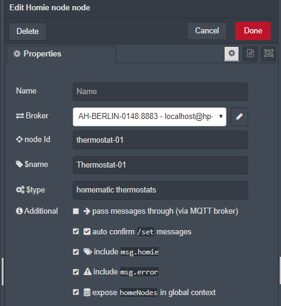

# homie node
Node-RED can expose it's services to the outside world by using the homie-node. For every *homie node* one node is placed in the editor. By sending a message to this node the properties on the mqtt broker can be updated. If an update on the `property/set` topic a message is sent to the output.
The homie-device node can be used as a counterpart to receive the updates. Through this node the outside world can read property updates and send commands to Node-RED.

# configuration
## basic configuration
The configuration panel only contains the basic configuration of a node



parameter | description | &nbsp;
----------|-------------|-------
Name | The *optional* name of this node | optional
broker | The broker configuration. In this configuration you can define the basic homie device parameters | required
nodeId | a unique Id of this node. `homie/nodeId/#` | required
$name | the human readable name of this node | required by homie
$type | type description of this node | required by homie
pass messages | pass incoming messages from the input to the output via the mqtt broker | optional
auto confirm | automatically confirm updates from the `parameter/set` topic to the `parameter` topic | optional
include homie | include a `msg.homie`object with the homie configuration parameters of that property | optional
include error | include a `msg.error`object if an error occurs | optional
expose homieNodes | expose the `homieNodes` object in global context | optional

## parameter configuration

The json editor can be used to define the properties of a homie node. 
It is expected that the configuration can be done dynamically through the flow. Therefor a `msg.homie` message can be sent to the node on start or included with the first message. Both configurations **merge** so they can be used simultaneous or add new nodes and properties on the fly.

Here is an example: `msg=`
```json
{"homie":{
    "$name": "testThermostat-01",
    "$type": "homematic thermostat",
    "$properties": {
        "currentTemperature":{
            "$name": "current temperature",
            "$datatype": "float",
            "$settable": false,
            "$retained": false,
            "$format":"-20:40",
            "$unit": "°C"
        },
        "targetTemperature":{
            "$name": "target temperature",
            "$datatype": "float",
            "$settable": true,
            "$retained": true,
            "$format":"10:28",
            "$unit": "°C"
        },
        "currentValve":{
            "$name": "current valve state",
            "$datatype": "float",
            "$settable": false,
            "$retained": false,
            "$format":"0:100",
            "$unit": "%"
        }
    }
}
```
### advanced configuration
The nodeId defined in the configuration can be overridden by sending `msg.nodeId` with the `msg.homie` message. Do access individual nodes the `msg.topic` must contain `nodeId/propertyId`. To receive the output of other nodes than specified in the configuration you can either use the home-device node or define **[any]** as nodeId.

# usage

## send a status update to the mqtt broker

parameter | description
--------- | -----------
**msg.topic** | the topic of this parameter. it can be either the full homie path `homie/deviceId/nodeId/parameterId` or a part of it. The `paramterId` is required
**msg.payload** | the payload to be sent to the broker

The payload will be formatted to fit into the homie convention as defined by the `$datatype`and `$format` parameter

## receive a update/command from the mqtt broker

updates to a device parameter are received via the `parameterId/set` topic. If a message arrives the node will issue a formatted message to the output

The homie convention demands that the received value is acknowledged by the device as soon as it is successfully processed. This could be done automatically. If Node-RED is acting on behalf another device the value should be acknowledged as soon as the other device confirms success.


