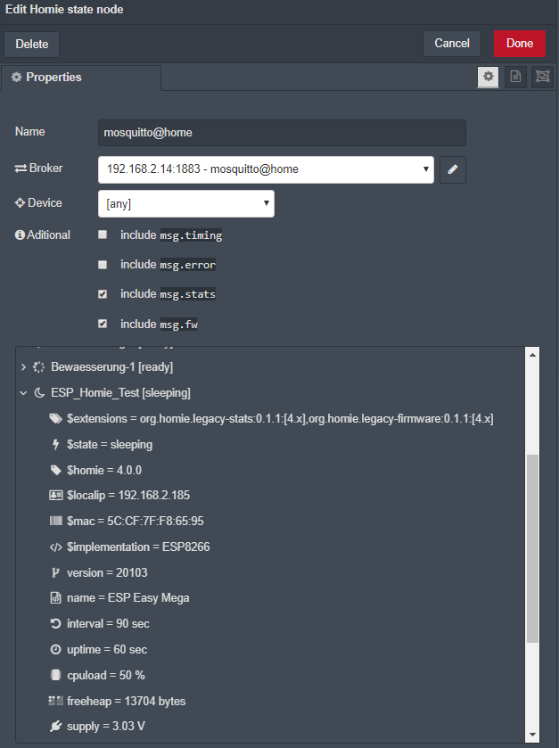

# homie node pro

Create "virtual" or "translated" devices according to the homie standard

# theory of operations

# Configuration

parameter | description | &nbsp;
----------|-------------|-------
Name | Optionally specify a name | optional
Broker | Select the mqtt broker where your device is sending messages to. | required

## basic configuration
Device : Optionally select the device to address. If specified, it filters messages messages from a specific device.
extra configuration

## additional

Additional information like timing, errors, stats and firmware can be added to the msg object

parameter | description | &nbsp;
----------|-------------|-------
msg.timing | Select to receive timing information.
msg.error | Select to receive error information. All Errors will be sent on 2nd output
msg.stats | Select to receive data provided by the Legacy Stats extension.
msg.firmware | Select to receive data provided by the Legacy Firmware extension.

# Inputs

property | type | contents | description
---|---|---|---
`payload` | string |device name or [any] | the node only emits a state messages when it receives an update via mqtt. Send the device name to receive the last know FULL state of the device
`brokerPath` | string | path to mqtt broker | optional full broker url in case of a multi broker environment

# Outputs
Standard output
property | type | contents | description
---|---|---|---
msg.payload | string | payload of the $stats topic
msg.topic | string | uique deviceID of the emitting device (broker URL + device name)
msg.deviceId | string | Name of the device the message came from
msg.state | object | containing basic device information
containing stats ($stats) information
containing firmware ($fw) information
# Details
The Homie convention defines a standardized way of how IoT devices and services announce themselves and their data on the MQTT broker.
It is thereby a crucial aspect on top of the MQTT protocol for automatic discovery, configuration and usage of devices and services.
Form more Information head over to [https://homieiot.github.io/](https://homieiot.github.io/)

# References
Homie Convention - full specification of the Homie Convention
GitHub - the nodes github repository