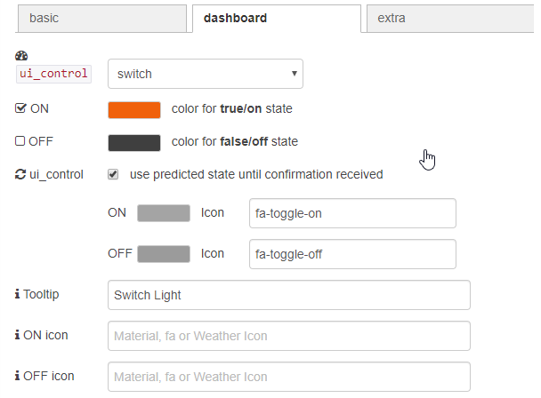

# node-red-contrib-homie-convention

## introduction

>The Homie convention defines a standardized way of how IoT devices and services announce themselves and their data on the MQTT broker.
>
>It is thereby a crucial aspect on top of the MQTT protocol for automatic discovery, configuration and usage of devices and services.

Details of the homie convention are available here [https://homieiot.github.io/]

## changelog

* 0.0.1 Initial release

## concept

Announcements for `devices`/`nodes`/`properties` are stored on the mqtt broker as retained messages or sent "live". The homie-convention node collects the retained messages and makes it easy to select the property of interest. 
Additional attributes can be translated to useful messages to configure dashboard nodes.
The node sends messages received on the input to the configured property. It also tries to convert data types if possible

## configuration

The Node uses one configuration node to define the mqtt broker to be used

parameter | description
----------|------------
Name | Optionally specify a name
Broker | Select the mqtt broker where your device is sending messages to.

## broker configuration

First a broker has to be configured. Enter IP-Address and port number and give it an unique name.

parameter | description
----------|------------
MQTT host | IP address of the broker
MQTT port | Port number
root topic | root topic, should not be changed
Homie name | name to identify this instance of Node-RED
Device name | name of this device / configuration
global context | check if you like a copy of the homie configuration tree to be put into the global context store. The context store can accessed by other function nodes to make use of homie data directly using global.get("homieStore"). The root of the object is the name of the broker so multiple brokers can be used.

## basic configuration

parameter | description
----------|------------
Settable | Properties list will only show settable properties. Is selected wildcards for properties are not possible
Device | Optionally select the device to address. If specified, it filters messages messages from a specific device. Wildcard [any] possible.
Node | Optionally select the node to address. If specified, it filters messages messages from a specific device. Wildcard [any] possible.
Property | Optionally select the property to address. If specified, the node only emmits updates from a specific property. It is necessary to specified individual name for settable properties.

## item list
All items which pass the filter depending on the settings `devices`, `nodes`,  `properties` and the `settable` flag are listed here. Know property configuration is listed. Problems are marked with (?) and error descriptions can be found here too.

## dashboard configuration
The homie node can do the configuration of dashboard nodes according to the information provided through the auto-discover functionality.
A Message will be sent as soon as all necessary data was received.

Typically dashboard items which can send values like buttons or sliders are wired as a feedback loop

**IMPORTANT WARNING:**
make sure to deselect `If msg arrives on input, set slider to new payload value:` otherwise you can create a infinite loop flooding your devices and mqtt broker.

## predicted states
The homie convention defines a topic for sending *original* information to the broker and one for sending *settable* information to a parameter *.../parameter/**set***

* a sensor **device** sends data to the *.../parameter* topic i.e. a new temperature measurement
* a **controller** sends data to the *.../parameter/set* topic to manipulate data i.e. a new dimmer value of light bulb.
* the **device** confirms the new *.../set* value by sending the new value to *.../parameter* to inform the **controller** (and all others who are subscribed to this topic) about the new value.

The state between sending data to the *../parameter/set* topic and receiving the new value on *../parameter* is the **predicted** state. Node-RED predicts the new value but don't know if it actually arrived on the device or it was even possible to fullfil the request. Only when a new value arrive on *.../parameter* the **predicted** flag is removed.
The new value is not necessarily the same as the send value. It can be limited by boundary check by the device, rejected or altered by another input in the meantime. 

This mechanism makes it possible to determine if the value was send by a **controller** a to the **device** or if the values origin is the device itself and therefore so has a good chance to be the actual state of the device.

This logic is currently not (or only partially) implemented in the dashboard nodes by default. The *homie-convention-node* tries to implement this by using the msg.ui_control object. As the capabilities of each dashboard node differs the destination node has to be selected.

parameter | description
----------|------------
Node | select the type of node you like to connect to the output. Individual options will appear. Most of the options are set by using the ui_control object.

## button
You can set the foreground and background color together with a tooltip text and an [font awesome 4.7](https://fontawesome.com/v4.7.0/icons/) icon.

parameter | description
----------|------------
Label | Color of the label text
Background | Background color of the button
Tooltip | Tooltip if user hoovers over the element. Needs reload of the dashboard to appear.

## button as switch
You can set the foreground and background color together an ON and OFF color. If you like you can use colors for the state between sending a payload to your device and a value arriving on the input. This way non confirmed states can be indicated.
 A tooltip text and an [font awesome 4.7](https://fontawesome.com/v4.7.0/icons/) icon can be specified.

parameter | description
----------|------------
Label | Color of the label text
Background | Background color of the button without known state
ON | color for true/on state
OFF | color for false/off state
predicted ON | check if you want that the button have this color when set to ON until a new state on the input arrives
predicted OFF | check if you want that the button have this color when set to OFF until a new state on the input arrives
Tooltip | Tooltip if user hoovers over the element. Needs reload of the dashboard to appear.

## chart
The min and max values received by the homie `$format` attribute can be used to limit the Y-axis range. Use the msg.label feature to name the individual curves if you have selected wildcards in the basic configuration tab.

parameter | description
----------|------------
min max | use $format parameter to set ui_control.max and ui_control.min
color picker
format | use $format to set ui_control.format to rgb or hsv
dropdown
format | use $format to fill option list
### gauge, numeric, slider

parameter | description
----------|------------
min max | use $format parameter to set ui_control.max and ui_control.min
### switch

parameter | description
------------------|------------
ON | color for true/on state
OFF | color for false/off state
predicted| use predicted state after sending new message until a new value received on the input
predicted ON | optional color and icon for ON predicted state
predicted OFF | optional color and icon for ON predicted state
Tooltip | Tooltip if user hoovers over the element. Needs reload of the dashboard to appear.
ON icon| optional icon for true/on state
OFF icon| optional icon for false/off state
### text

parameter | description
----------|------------
format | use $unit for {{value}} $unit if available
### text input
no ui_control parameters useful

## label

parameter | description
----------|------------
msg.label | Select add label (i.e. for chart ui node) select which attribute should be used as a label.
custom label| Enter a custom Label
msg.topic | copy the label to msg.topic
msg.topic | copy the label to msg.payload. Only for startup messages.

## extra configuration
Additional information like timing, errors and atrributes can be added to the msg object

parameter | description
----------|------------
msg.timing | Select to receive timing information.
msg.error | Select to receive error information. All Errors will be sent on 2nd output
msg.attributes | Select to receive attributes information.

## Inputs
payload number | string | buffer
the payload of the message to send to the homie device.
topic string
the homie topic to publish to. This can override the node configuration. If empty the node settings will be used. If not matching a known property topic will be ignored.

## outputs
### standard output
parameter | type | description
----------|------|------------
msg.payload| string, number | the standard output of a sucsessfull received message. Depending on the datatype as a string or number.
msg.message| string | original message received by the mqtt client
msg.value| number | Numeric value of the message. Im case of enum properties the index of the selected item. 

### additional output if selected
parameter | type | description
----------|------|------------
msg.topic | string| Topic of the value deviceID/nodeID/propertyID.
msg.device| string | Name of the device the message came from
msg.node| string | Name of the node the message came from
msg.property| string | Name of the property emitting this message
msg.attributes.datatype | string | value of the $datatype attribute.
msg.attributes.format | string | value of the $format attribute.
msg.attributes.unit | string | value of the $unit attribute.
msg.timing.timeReceived | timestamp | unix timestamp when a message was received
msg.timing.interval | number | time in milliseconds since the last update was received.
msg.timing.msgCounter | number | number of update since last restart.
msg.error.state | string | "ok", "warn", "error".
msg.error.text | string | Error message.
msg.label | string | Label property as defined in the node configuration. Useful for chart UI node.

### error

parameter | type | description
----------|------|------------
payload | object | Error message if an error accrued while receiving or converting a message.

## references
* [Homie Convention](https://homieiot.github.io/) - full specification of the Homie Convention
* [GitHub](https://github.com/Christian-Me/node-red-contrib-homie-convention) - the github repository of the homie-convention-node

## to do / limitations

- [ ] Use the Build in MQTT client to make full use of the configurations (password / encryption) or add minimal security to the currently used client
- [ ] detect offline nodes by checking the interval of received messages
- [ ] make use of the `$state` attribute
- [ ] implement extensions
- [ ] special node to make Node-RED a homie device announcing services
- [ ] write the documentation *good* english as I*m nott a native speaker, sorry.
